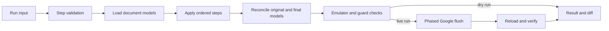

# Architecture

## Overview

gdocsmith has one model-first pipeline for dry and live runs. Step handlers edit
only an in-memory model. The transaction flush is the only layer that contacts
Google.

## Layers

| Layer | Owns |
| --- | --- |
| `src/commands/run/` | Public run input and output schemas plus CLI/MCP handler. |
| `src/core/steps/` | Static validation, reference resolution, step mapping, queries, file output, and orchestration. |
| `src/core/engine/` | Session facade, planning, safeguards, flush, transaction retries, and verification. |
| `src/core/model/` | Parsed document model, editing primitives, list/table rules, layout, and invariants. |
| `src/core/lens/` | Anchors, markdown projection, rendering, parsing, and write-back alignment. |
| `src/core/reconcile/` | Minimal Google Docs requests derived from original versus final models. |
| `src/core/emulator/` | Offline request emulator, fake Google client, and recorded conformance fixtures. |

## Transaction

`transactionRun(program, options)` creates one core session per attempt. The
program is deterministic: the step layer may use session handles but not direct
network calls, clocks, or random values.

1. Documents load from cache or Google with their revision IDs.
2. Steps mutate model handles and produce a final model.
3. Reconciliation creates minimal requests, then the emulator checks that those
   requests produce the same model.
4. Safeguards evaluate comments, suggestions, named ranges, linked headings,
   unrecreatable content, list rebuilds, and revision view mode.
5. Live work sends phases in order: `create`, `content`, `tabs`, `links`, then
   `permissions`.
6. A conflict before content lands reloads and reruns the program. A later
   failure reports the landed phases instead of claiming atomicity.

## Model Rules

- Blocks, rows, columns, cells, and atoms receive stable original or new keys.
- Every container ends with a paragraph. Tables and section breaks are preceded
  by one; page breaks occupy standalone paragraphs.
- Text diffs operate on Unicode code points while Docs indices remain UTF-16.
- Kept paragraphs receive character-level changes; unchanged paragraphs generate
  no requests.
- Tables reconcile content, shape, merges, and styles in an API-safe order.
- List nesting and kind changes rebuild only the affected list run when the API
  cannot perform the change in place.

## Verification

The emulator is checked against recorded live conformance fixtures. After a live
flush, gdocsmith reloads affected documents and compares them with the predicted
model. A mismatch is reported rather than silently accepted.