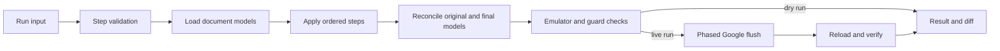

# Architecture

## Overview

gdocsmith has one model-first pipeline for dry and live runs. Step handlers edit
only an in-memory model. The transaction flush is the only layer that contacts
Google.

## Layers

| Layer | Owns |
| --- | --- |
| `src/commands/run/` | Public run input and output schemas plus CLI/MCP handler. |
| `src/core/steps/` | Static validation, reference resolution, step mapping, queries, file output, and orchestration. |
| `src/core/engine/` | Session facade, planning, safeguards, flush, transaction retries, and verification. |
| `src/core/model/` | Parsed document model, editing primitives, list/table rules, layout, and invariants. |
| `src/core/lens/` | Anchors, markdown projection, rendering, parsing, and write-back alignment. |
| `src/core/reconcile/` | Minimal Google Docs requests derived from original versus final models. |
| `src/core/emulator/` | Offline request emulator, fake Google client, and recorded conformance fixtures. |

## Transaction

`transactionRun(program, options)` creates one core session per attempt. The
program is deterministic: the step layer may use session handles but not direct
network calls, clocks, or random values.

1. Documents load from cache or Google with their revision IDs.
2. Steps mutate model handles and produce a final model.
3. Reconciliation creates minimal requests, then the emulator checks that those
   requests produce the same model.
4. Safeguards evaluate comments, suggestions, named ranges, linked headings,
   unrecreatable content, list rebuilds, and revision view mode.
5. Live work sends phases in order: `create`, `content`, `tabs`, `links`, then
   `permissions`.
6. A conflict before content lands reloads and reruns the program. A later
   failure reports the landed phases instead of claiming atomicity.

## Model Rules

- Blocks, rows, columns, cells, and atoms receive stable original or new keys.
- Every container ends with a paragraph. Tables and section breaks are preceded
  by one; page breaks occupy standalone paragraphs.
- Text diffs operate on Unicode code points while Docs indices remain UTF-16.
- Kept paragraphs receive character-level changes; unchanged paragraphs generate
  no requests.
- Tables reconcile content, shape, merges, and styles in an API-safe order.
- List nesting and kind changes rebuild only the affected list run when the API
  cannot perform the change in place.

## Verification

The emulator is checked against recorded live conformance fixtures. After a live
flush, gdocsmith reloads affected documents and compares them with the predicted
model. A mismatch is reported rather than silently accepted.

## Deferred Work and Verification Gaps

G3/G4 completion means their listed gates passed; it does not mean the following
secondary behaviors are implemented or verified. The M2 acceptance criteria in
the master plan define future work; this section records current behavior.

### Links-Phase Revision Conflicts

Pending links are resolved from planned source offsets and target-heading
positions after content has landed. The links phase has no conflict retry or
relocation: a stale revision fails the phase, content may already be live, and
the caller must re-query before retrying. Existing transaction tests cover
successful same-run links and later-phase failures, but not a links conflict.
Future acceptance: retry once against fresh documents, uniquely relocate both
the source span and target heading, and never replay landed content. Ambiguous
relocation or a second conflict must report accurate landed and unsent work.

### Table-Row Alignment

`tableAlign` pairs rows by exact cell text and similarity over shared columns. It
does not receive row anchors or weights, so equally good matches are not chosen
to preserve comments or named ranges, nor is row-level tie ambiguity refused.
The plan's emulator and existing safeguards still apply to the selected
alignment, but do not make it anchor-aware. Current tests cover ordinary row
add/delete/edit and column-header ambiguity; they do not cover anchored row ties.
Future acceptance: use available row anchors to break equal-cost ties and refuse
unresolved ambiguity, with tests proving protected rows are not needlessly
deleted or recreated.

### Lossy Custom-List Copies

The core copy primitive detects a custom list copied to a default preset and
returns a human-readable note. The public `run` path currently drops that note:
the `write from` and tab-copy handlers discard `WriteReport.notes`, while run
warnings are built only from guard findings. The `listLossy` guard kind is
declared but not emitted. Thus the conversion is silent to run-tool callers;
the lower-level copy API does expose the note. Existing copy unit tests verify
that note, but no step/result test verifies a user-visible warning. Future
acceptance: expose a step-attributed warning in both dry and live results and
test custom and preset list copies through `run`.

### Indented Paragraphs Converted to Lists

Converting a kept paragraph with an explicit indent into a markdown list remains
unsupported. An offline `FakeGoogle` reproduction currently fails closed with
`UNMODELED: bulleting an indented paragraph` during planning; no request is sent.
G3 M20 recorded the related self-check limitation. No dedicated regression test
covers this transition. Future acceptance: either support the conversion with
matching emulator and live behavior, or reject it with an actionable error
before sending; preserve the no-send self-check guarantee meanwhile.

### Corpus and Comment Verification

The local lens-corpus test is read-only and skips when its SQLite cache is
absent. With the current default-home cache, it fails GetPut for one tab in both
markdown modes (24 blocks read back, expected 23). Running the full check with
an empty temporary `HOME` passes but exercises no real corpus; it is not corpus
evidence. Keep the local failure visible until investigated.

Guard tests exercise synthetic comments and suggestions offline. The live suite
cannot create those anchors through the API, and no UI-authored comment fixture
has been validated end to end. Quote matching against Drive comments therefore
remains heuristic and lacks live anchor verification. Future acceptance: use a
controlled UI-authored fixture to check comment anchors before and after safe
edits and refusals; do not treat offline guard tests as live proof.