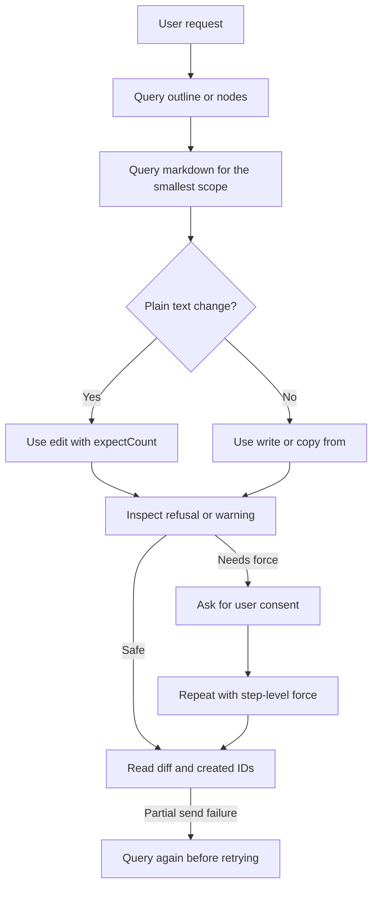

# Editing Runbook

## Practical Loop

1. Start with `query` output `outline` for an unfamiliar document.
2. Use markdown output for the smallest section or node that needs work.
3. Prefer `edit` for a literal phrase and `write` for structured markdown.
4. Read the result. A diff and the entry at `steps[i]` tell you what changed.
5. When a send fails after a phase lands, query again before making a new run.

Do not manufacture anchors or calculate character positions. A narrow query is
cheaper and safer than recovery from a broad replacement.