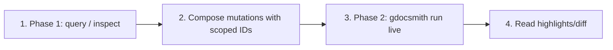
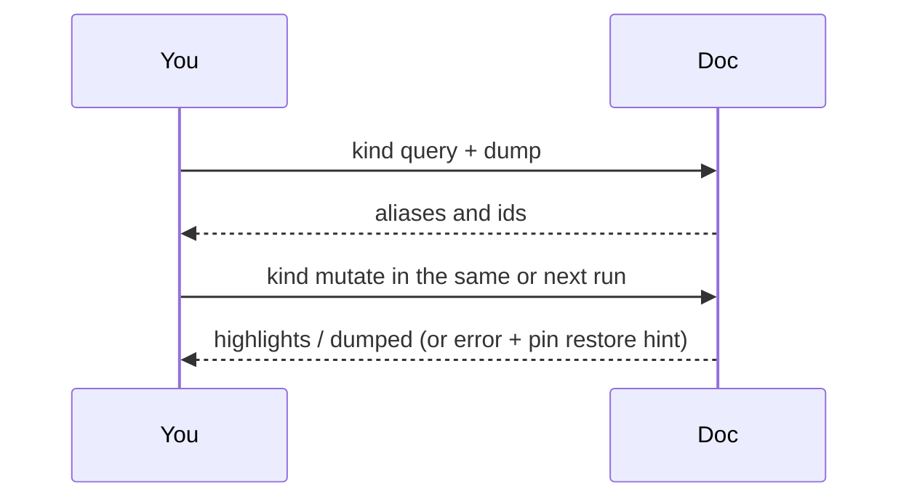

# How to edit

Selectors / ops: [mechanics.md](mechanics.md). Taste: [style.md](style.md). Images: [images.md](images.md). Comments: [comments.md](comments.md).

Two-phase authoring: Phase 1 inspects with `dump: true` / `kind: query`; Phase 2 mutates using explicit heading-scoped IDs.



```json
{
  "dryRun": false,
  "steps": [
    { "kind": "docOpen", "doc": "<documentId>", "as": "spec" },
    { "kind": "replace", "doc": "spec", "nodeAt": "h.status.1a2b", "replace": "Shipped" }
  ]
}
```

```bash
gdocsmith run < workflow.json
```

## 1. Query

Use the Doc ID the user gave (extract from URL between `/d/` and `/edit`) — not another Drive copy.

`kind: query` maps headings and heading-scoped ids (`h.arch.9a1b`). Scope with `nodeUnder:`, `contains:`, and `tab:`. `output: markdown` (or `nodes`) serializes the match set. Copy `nodeAt` / `nodeAfter` / `nodeBefore` from dumped ids. Do not invent nodes. Do not find headings with `:contains` CSS.

Multi-tab: set `tab:` on the step (`id` or unique title). Lifecycle: `kind: tabAdd` / `tabRename` / `tabDelete`.

Header/footer chrome is not on the body tape and is not a `run` kind yet — use the Docs UI.

## 2. Add steps

Each step is one action. `kind: replace` / `innerText` may include `style` on the same step. Inserts (`element` / `elements` / `markdownInsert`) and `remove` stay exclusive.

Several related edits = one `steps` list. Use `as:` to label new docs, tabs, and nodes so later steps can reference them (`nodeAfter: name`, `nodeAt: name.0.1`).

## 3. Run

`dryRun: true` returns a unified git diff and does not write. Live runs return `highlights` and `dumped`. Do not get stuck in repetitive dry-run loops.

`force: true` skips glyph/empty-bullet guards — only if the user asked.

## 4. Read and discard

Confirm `dumped` / `highlights` match intent. Snapshot ids are spent after a live write. Another pass = new `kind: query`. If a write failed: stop, restore the Drive pin if the Doc looks half-written, query again — do not retry the same spent ids.

Table insert + cell fill is two API calls; a half-written table is a pin restore, not more steps.


